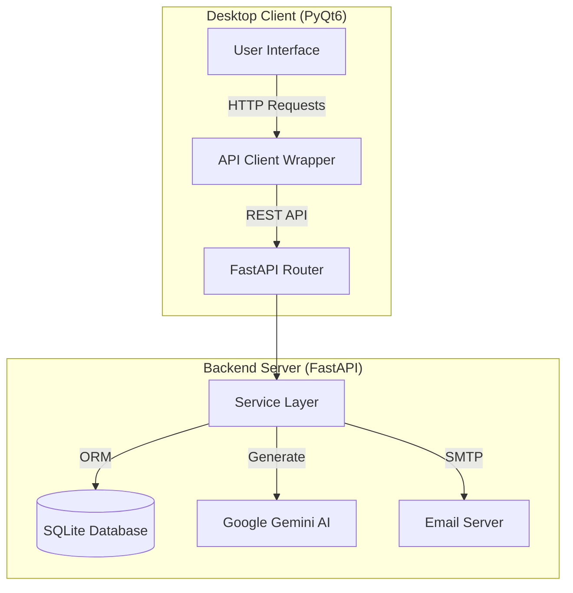

# System Architecture & Dependency Graph

## High-Level Architecture

The system follows a **Decoupled Client-Server Architecture**.

*   **Server**: A headless Python/FastAPI backend responsible for data persistence, business logic, AI processing, and scheduled tasks.
*   **Client**: A desktop application built with Python/PyQt6, communicating with the server exclusively via HTTP REST APIs.
*   **External Services**:
    *   **Google Gemini API**: For document analysis.
    *   **SMTP Server**: For email notifications (supports SSL and STARTTLS).

## Dependency Graph

### Backend (`app/`)
*   **Entry Point**: `app.main:app` (Lifespan manager, APScheduler init).
*   **Core Dependencies**:
    *   `fastapi`: Web framework.
    *   `sqlalchemy`: ORM for SQLite.
    *   `google-generativeai`: AI Client.
    *   `pydantic`: Data validation.
    *   `apscheduler`: Background task scheduling.
    *   `fpdf2`: PDF Report generation.

### Frontend (`desktop_app/`)
*   **Entry Point**: `desktop_app.main`.
*   **Core Dependencies**:
    *   `PyQt6`: GUI Framework.
    *   `requests`: HTTP Client.

## Component Interaction

### 1. Data Ingestion (AI Pipeline)
1.  **Client**: Sends PDF bytes to `POST /upload-pdf/`.
2.  **Backend (`ai_extraction.py`)**:
    *   Calls Google Gemini `models/gemini-2.5-pro`.
    *   Prompt enforces "Single-Pass" extraction and classification.
3.  **Response**: JSON with extracted entities.
4.  **Client**: Displays data in "Import View".

### 2. Notification System
1.  **Trigger**: Scheduled job (APScheduler) or Manual API Call (`POST /send-manual-alert`).
2.  **Service (`notification_service.py`)**:
    *   Queries `Certificato` where `data_scadenza_calcolata` is within threshold.
    *   Thresholds: `ALERT_THRESHOLD_DAYS` (default 60), `ALERT_THRESHOLD_DAYS_VISITE` (default 30).
    *   **PDF Generation**: Uses `fpdf2` to create an in-memory PDF report.
    *   **Email Dispatch**: Connects via `smtplib` (auto-detects SSL vs STARTTLS based on port).

### 3. Validation Workflow
1.  **Status**: Certificates start with `stato_validazione='AUTOMATIC'`.
2.  **Client**: Fetches these via `GET /certificati/?validated=false`.
3.  **Action**: User validates -> `PUT /certificati/{id}/valida` -> Status becomes `MANUAL`.
4.  **Visibility**: Only `MANUAL` certificates appear in the main Dashboard.
