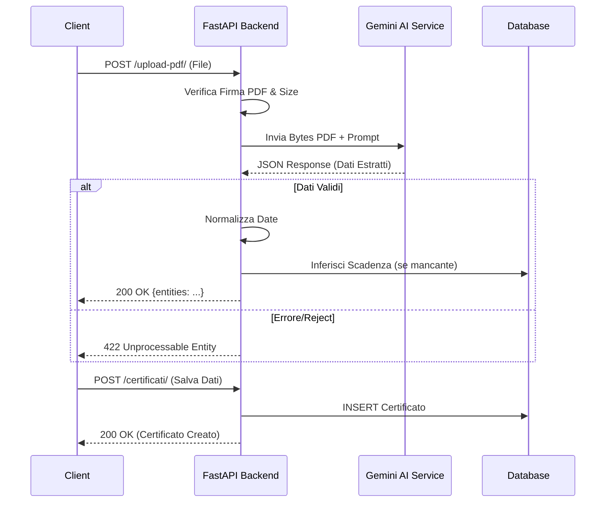

Ecco la documentazione API completa ed esaustiva per il progetto **Intelleo**, basata sull'analisi approfondita del codice sorgente fornito (`app/main.py`, `app/api/main.py`, routers vari e modelli Pydantic).

# API_DOCUMENTATION.md

# Documentazione API Intelleo v1.0.0

Questa documentazione descrive l'interfaccia RESTful del backend di Intelleo (basato su FastAPI). Le API permettono la gestione di dipendenti, certificati di formazione, analisi AI di documenti PDF, configurazione del sistema e audit log.

## 1. Overview

*   **Base URL**: `http://localhost:8000/api/v1` (Default)
*   **Protocollo**: HTTP/1.1
*   **Formato Dati**: JSON (application/json)
*   **Encoding**: UTF-8

### Autenticazione
L'autenticazione avviene tramite **OAuth2 con Password Flow**.
Ogni richiesta protetta deve includere l'header:
`Authorization: Bearer <access_token>`

### Rate Limiting
Non è implementato un rate limiting globale esplicito nel codice, tuttavia l'endpoint di analisi AI (`/upload-pdf/`) gestisce gli errori `429 Resource Exhausted` provenienti dalle API di Google Gemini.

### Headers Personalizzati
*   `X-Device-ID`: (Opzionale) Identificativo univoco del dispositivo client, utilizzato per i log di audit.

---

## 2. Endpoints

### 2.1 Autenticazione (`/auth`)

#### **Login (Ottieni Token)**
Autentica un utente e restituisce un token di accesso JWT. Gestisce anche il blocco del database (Session Lock).

*   **Method**: `POST`
*   **Path**: `/auth/login`
*   **Content-Type**: `application/x-www-form-urlencoded`

**Parametri Body:**
| Campo | Tipo | Obbligatorio | Descrizione |
|-------|------|--------------|-------------|
| `username` | string | Sì | Nome utente |
| `password` | string | Sì | Password |

**Risposta (200 OK):**
```json
{
  "access_token": "eyJhbG...",
  "token_type": "bearer",
  "user_id": 1,
  "username": "admin",
  "account_name": "Amministratore",
  "is_admin": true,
  "read_only": false,
  "require_password_change": false
}
```

**Errori:**
*   `400 Bad Request`: Credenziali errate.
*   `422 Validation Error`: Formato dati non valido.

---

#### **Logout**
Invalida il token corrente aggiungendolo alla blacklist e rilascia il lock del database.

*   **Method**: `POST`
*   **Path**: `/auth/logout`
*   **Auth**: Richiesto

**Risposta (200 OK):**
```json
{
  "message": "Successfully logged out"
}
```

---

### 2.2 Certificati (`/certificati`)

#### **Lista Certificati**
Recupera la lista dei certificati, filtrabile per stato di validazione.

*   **Method**: `GET`
*   **Path**: `/certificati/`
*   **Auth**: Richiesto
*   **Query Params**:
    *   `validated` (bool, opzionale): `true` per certificati validati (manuali), `false` per quelli automatici/orfani.

**Esempio cURL:**
```bash
curl -X GET "http://localhost:8000/api/v1/certificati/?validated=true" \
     -H "Authorization: Bearer <TOKEN>"
```

**Risposta (200 OK):**
```json
[
  {
    "id": 1,
    "nome": "Mario Rossi",
    "corso": "ANTINCENDIO",
    "categoria": "ANTINCENDIO",
    "data_rilascio": "01/01/2024",
    "data_scadenza": "01/01/2029",
    "stato_certificato": "attivo",
    "matricola": "MR001"
  }
]
```

---

#### **Crea Certificato**
Crea manualmente un nuovo certificato.

*   **Method**: `POST`
*   **Path**: `/certificati/`
*   **Auth**: Richiesto (Richiede permessi di scrittura)

**Body (JSON):**
```json
{
  "nome": "Mario Rossi",
  "corso": "Corso Base",
  "categoria": "SICUREZZA",
  "data_rilascio": "01/01/2024",
  "data_scadenza": "01/01/2029",
  "data_nascita": "15/05/1980"
}
```

**Errori:**
*   `409 Conflict`: Certificato duplicato esistente.
*   `503 Service Unavailable`: Database in sola lettura.

---

#### **Carica e Analizza PDF (AI)**
Carica un file PDF ed esegue l'estrazione delle entità tramite Google Gemini.

*   **Method**: `POST`
*   **Path**: `/upload-pdf/`
*   **Auth**: Richiesto (Richiede permessi di scrittura)
*   **Content-Type**: `multipart/form-data`

**Parametri:**
*   `file`: Il file PDF (binario). Max size configurabile (default 20MB).

**Risposta (200 OK):**
```json
{
  "filename": "certificato.pdf",
  "entities": {
    "nome": "ROSSI MARIO",
    "data_nascita": "12/05/1985",
    "corso": "Addetto Antincendio",
    "data_rilascio": "10/01/2024",
    "data_scadenza": "10/01/2029",
    "categoria": "ANTINCENDIO"
  }
}
```

**Errori:**
*   `413 Payload Too Large`: File troppo grande.
*   `422 Unprocessable Entity`: AI ha rifiutato il documento (es. Syllabus generico).
*   `429 Too Many Requests`: Quota API AI esaurita.

---

#### **Convalida Certificato**
Marca un certificato come validato manualmente.

*   **Method**: `PUT`
*   **Path**: `/certificati/{id}/valida`
*   **Auth**: Richiesto

**Risposta (200 OK):** Restituisce l'oggetto certificato aggiornato.

---

### 2.3 Dipendenti (`/dipendenti`)

#### **Importa CSV**
Importa massivamente i dipendenti da un file CSV. Collega automaticamente i certificati orfani.

*   **Method**: `POST`
*   **Path**: `/dipendenti/import-csv`
*   **Auth**: Richiesto
*   **Content-Type**: `multipart/form-data`

**Formato CSV Richiesto:**
Separatore `;`. Colonne minime: `Cognome`, `Nome`, `Badge` (Matricola). Opzionale: `Data_nascita`.

**Risposta (200 OK):**
```json
{
  "message": "Importazione completata con successo. 5 certificati orfani collegati.",
  "warnings": ["Duplicato rilevato per Bianchi Luigi..."]
}
```

---

### 2.4 Chat AI (`/chat`)

#### **Invia Messaggio**
Interagisce con l'assistente "Lyra" utilizzando RAG (Retrieval-Augmented Generation) sui dati del database.

*   **Method**: `POST`
*   **Path**: `/chat/`
*   **Auth**: Richiesto

**Body (JSON):**
```json
{
  "message": "Chi ha il corso antincendio scaduto?",
  "history": [
    {"role": "user", "content": "Ciao"},
    {"role": "model", "content": "Ciao! Come posso aiutarti?"}
  ]
}
```

**Risposta (200 OK):**
```json
{
  "response": "Ecco i dipendenti con corso Antincendio scaduto:\n- Mario Rossi (Scaduto il 12/05/2023)..."
}
```

---

### 2.5 Configurazione App (`/app_config`)

#### **Ottieni Configurazione Mutabile**
Recupera le impostazioni configurabili dall'utente (SMTP, API Keys, Soglie).

*   **Method**: `GET`
*   **Path**: `/app_config/config`
*   **Auth**: Richiesto (Solo Admin)

**Risposta (200 OK):**
```json
{
  "SMTP_HOST": "smtps.aruba.it",
  "SMTP_PORT": 465,
  "VOICE_ASSISTANT_ENABLED": true,
  "ALERT_THRESHOLD_DAYS": 60,
  "GEMINI_API_KEY_ANALYSIS": "obf:..."
}
```
*Nota: Le chiavi sensibili sono restituite offuscate (`obf:...`).*

#### **Aggiorna Configurazione**
*   **Method**: `PUT`
*   **Path**: `/app_config/config`
*   **Auth**: Richiesto (Solo Admin)
*   **Body**: JSON parziale o completo con le chiavi da aggiornare (vedi `MutableSettingsSchema`).

---

### 2.6 Sistema (`/system`)

#### **Trigger Manutenzione**
Avvia il task di background per spostare i file scaduti nello storico e pulire i log.

*   **Method**: `POST`
*   **Path**: `/system/maintenance/background`
*   **Auth**: Richiesto

**Risposta (200 OK):** `{"status": "started"}` o `{"status": "skipped"}`.

#### **Ottimizza Database**
Esegue `VACUUM` e `ANALYZE` su SQLite e sincronizza i file.

*   **Method**: `POST`
*   **Path**: `/system/optimize`
*   **Auth**: Richiesto (Solo Admin)

---

## 3. Modelli Dati (Schemas)

### CertificatoSchema
```json
{
  "id": "integer",
  "nome": "string",
  "data_nascita": "string (DD/MM/YYYY) | null",
  "matricola": "string | null",
  "corso": "string",
  "categoria": "string",
  "data_rilascio": "string (DD/MM/YYYY)",
  "data_scadenza": "string (DD/MM/YYYY) | null",
  "stato_certificato": "attivo | in_scadenza | scaduto | archiviato",
  "assegnazione_fallita_ragione": "string | null"
}
```

### DipendenteSchema
```json
{
  "id": "integer",
  "matricola": "string",
  "nome": "string",
  "cognome": "string",
  "data_nascita": "string (YYYY-MM-DD)",
  "email": "string | null",
  "mansione": "string | null",
  "categoria_reparto": "string | null"
}
```

### AuditLogSchema
```json
{
  "id": "integer",
  "username": "string",
  "action": "string",
  "category": "AUTH | DATA | CERTIFICATE | SYSTEM | USER_MGMT",
  "details": "string",
  "timestamp": "datetime (ISO 8601)",
  "severity": "LOW | MEDIUM | CRITICAL",
  "ip_address": "string"
}
```

---

## 4. Codici di Errore Globali

| Codice | Nome | Descrizione |
|--------|------|-------------|
| 200 | OK | Richiesta completata con successo. |
| 400 | Bad Request | Dati input non validi o azione non permessa. |
| 401 | Unauthorized | Token mancante, invalido o scaduto. |
| 403 | Forbidden | Utente autenticato ma senza permessi (es. non Admin) o Licenza scaduta. |
| 404 | Not Found | Risorsa non trovata (es. Certificato ID errato). |
| 409 | Conflict | Conflitto dati (es. duplicato) o operazione di scrittura su DB read-only. |
| 413 | Payload Too Large | File caricato supera il limite (PDF > 20MB, CSV > 5MB). |
| 422 | Unprocessable Entity | Errore validazione Pydantic o rifiuto logico AI. |
| 429 | Too Many Requests | Quota API esterna (Gemini) esaurita. |
| 500 | Internal Server Error | Errore generico lato server. |
| 503 | Service Unavailable | Database bloccato o in fase di avvio/errore critico. |

---

## 5. SDK e Librerie Client (Python Example)

Esempio di integrazione utilizzando `requests` in Python.

```python
import requests

API_URL = "http://localhost:8000/api/v1"

def login(username, password):
    resp = requests.post(f"{API_URL}/auth/login", data={
        "username": username,
        "password": password
    })
    if resp.status_code == 200:
        return resp.json()["access_token"]
    raise Exception(f"Login failed: {resp.text}")

def get_certificati(token):
    headers = {"Authorization": f"Bearer {token}"}
    resp = requests.get(f"{API_URL}/certificati/?validated=true", headers=headers)
    return resp.json()

def upload_pdf(token, file_path):
    headers = {"Authorization": f"Bearer {token}"}
    with open(file_path, 'rb') as f:
        files = {'file': (file_path, f, 'application/pdf')}
        resp = requests.post(f"{API_URL}/upload-pdf/", headers=headers, files=files)
    return resp.json()

# Utilizzo
try:
    token = login("admin", "password")
    certs = get_certificati(token)
    print(f"Trovati {len(certs)} certificati.")
except Exception as e:
    print(e)
```

---

## 6. Diagramma Flusso Analisi AI (Mermaid)



---

## 7. Changelog API

### v1.0.0 (Corrente)
*   **Feature**: Introduzione endpoint `/chat` con contesto RAG.
*   **Security**: Implementazione `db_security` con crittografia Fernet e In-Memory SQLite.
*   **Feature**: Endpoint `/dipendenti/import-csv` con logica "Upsert" e collegamento orfani.
*   **Feature**: Sistema di Audit Log completo.
*   **Fix**: Gestione robusta dei lock file e modalità Read-Only.
*   **Fix**: Migrazione a `gemini-2.5-pro` per l'estrazione dati.
