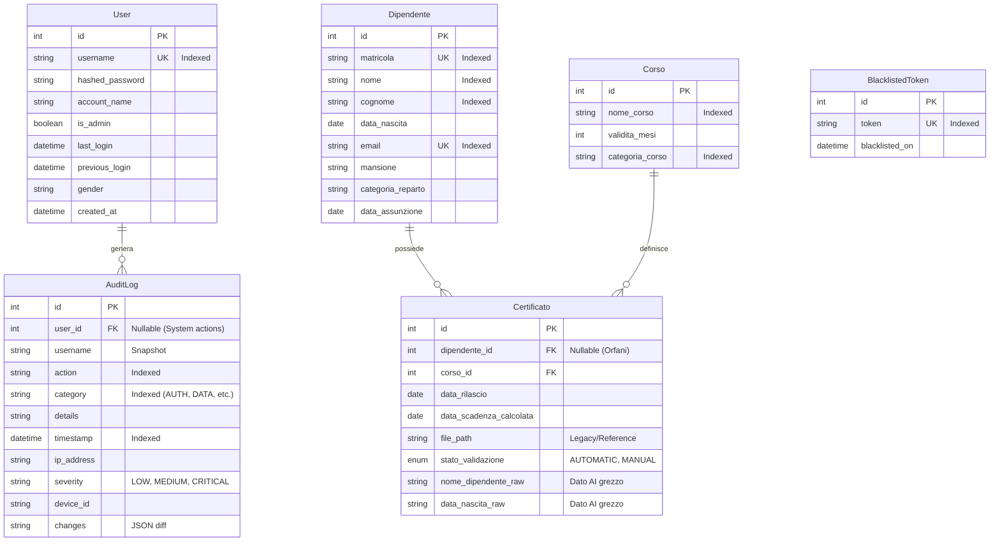

Ecco la documentazione completa e dettagliata dello schema del database per il progetto **Intelleo**.

# DATABASE_SCHEMA.md

## 1. Overview Database

Il sistema utilizza un'architettura **Secure In-Memory SQLite**. A differenza delle applicazioni standard, il database non risiede su disco in chiaro durante l'esecuzione, ma viene caricato in RAM, decifrato e gestito in memoria per massimizzare sicurezza e performance.

| Caratteristica | Dettaglio |
| :--- | :--- |
| **Engine** | SQLite 3 (tramite Python `sqlite3` e `SQLAlchemy`) |
| **Modalità** | **In-Memory** (`:memory:`) con persistenza serializzata su disco |
| **Sicurezza** | **Crittografia AES-128** (via `cryptography.fernet`) a riposo (su file) |
| **File Fisico** | `database_documenti.db` (default in `%LOCALAPPDATA%\Intelleo`) |
| **Locking** | Sistema proprietario `LockManager` (file `.lock`) per prevenire accessi concorrenti (Single-User Write) |
| **ORM** | SQLAlchemy 2.0+ (configurazione in `app/db/session.py`) |
| **Pool** | `StaticPool` (singola connessione condivisa per thread, necessaria per SQLite in-memory) |

---

## 2. Schema ER (Mermaid)



---

## 3. Tabelle e Collezioni

### 3.1. `users`
Gestione degli operatori che accedono al software.

| Colonna | Tipo | Constraints | Descrizione |
| :--- | :--- | :--- | :--- |
| `id` | INTEGER | PK, AI | Identificativo univoco utente. |
| `username` | VARCHAR | UNIQUE, INDEX, NOT NULL | Nome utente per login. |
| `hashed_password`| VARCHAR | NOT NULL | Hash bcrypt della password. |
| `account_name` | VARCHAR | NULLABLE | Nome visualizzato (es. "Mario Rossi"). |
| `is_admin` | BOOLEAN | DEFAULT FALSE | Flag privilegi amministratore. |
| `last_login` | DATETIME | NULLABLE | Timestamp ultimo accesso corrente. |
| `previous_login` | DATETIME | NULLABLE | Timestamp accesso precedente (per sicurezza). |
| `gender` | VARCHAR | NULLABLE | 'M' o 'F' (per UI personalization). |
| `created_at` | DATETIME | DEFAULT UTC_NOW | Data creazione account. |

### 3.2. `dipendenti`
Anagrafica del personale aziendale.

| Colonna | Tipo | Constraints | Descrizione |
| :--- | :--- | :--- | :--- |
| `id` | INTEGER | PK, AI | Identificativo interno. |
| `matricola` | VARCHAR | UNIQUE, INDEX | Badge/ID aziendale. Chiave di linking primaria. |
| `nome` | VARCHAR | INDEX | Nome del dipendente. |
| `cognome` | VARCHAR | INDEX | Cognome del dipendente. |
| `data_nascita` | DATE | | Usata per disambiguazione omonimi. |
| `email` | VARCHAR | UNIQUE, INDEX | Email per notifiche dirette. |
| `mansione` | VARCHAR | NULLABLE | Ruolo lavorativo. |
| `categoria_reparto`| VARCHAR | | Reparto di appartenenza. |
| `data_assunzione` | DATE | NULLABLE | Data di assunzione. |

### 3.3. `corsi`
Catalogo dei corsi di formazione e scadenze normative.

| Colonna | Tipo | Constraints | Descrizione |
| :--- | :--- | :--- | :--- |
| `id` | INTEGER | PK, AI | Identificativo corso. |
| `nome_corso` | VARCHAR | INDEX | Nome specifico (es. "Antincendio Rischio Alto"). |
| `validita_mesi` | INTEGER | | Durata validità in mesi (0 = infinito). |
| `categoria_corso` | VARCHAR | INDEX | Macrocategoria (es. "ANTINCENDIO", "PLE"). |

*Constraint Unico:* `UNIQUE(nome_corso, categoria_corso)`

### 3.4. `certificati`
Relazione tra dipendente e corso, rappresenta il documento fisico.

| Colonna | Tipo | Constraints | Descrizione |
| :--- | :--- | :--- | :--- |
| `id` | INTEGER | PK, AI | Identificativo certificato. |
| `dipendente_id` | INTEGER | FK(`dipendenti.id`), NULL | Link al dipendente. **NULL se Orfano**. |
| `corso_id` | INTEGER | FK(`corsi.id`), NOT NULL | Link al corso. |
| `data_rilascio` | DATE | | Data di conseguimento. |
| `data_scadenza_calcolata`| DATE | | Data scadenza (calcolata o estratta da AI). |
| `file_path` | VARCHAR | | Path relativo (legacy, ora calcolato dinamicamente). |
| `stato_validazione`| ENUM | | `AUTOMATIC` (da AI) o `MANUAL` (confermato). |
| `nome_dipendente_raw`| VARCHAR | | Nome estratto dall'AI (per certificati orfani). |
| `data_nascita_raw` | VARCHAR | | Data nascita estratta dall'AI (per matching). |

*Constraint Unico:* `UNIQUE(dipendente_id, corso_id, data_rilascio)`

### 3.5. `audit_logs`
Registro immutabile delle operazioni critiche.

| Colonna | Tipo | Constraints | Descrizione |
| :--- | :--- | :--- | :--- |
| `id` | INTEGER | PK, AI | ID Log. |
| `user_id` | INTEGER | FK(`users.id`), NULL | Utente che ha eseguito l'azione. |
| `username` | VARCHAR | INDEX | Snapshot username (per storicizzazione se user cancellato). |
| `action` | VARCHAR | INDEX, NOT NULL | Codice azione (es. `LOGIN`, `CERTIFICATE_UPDATE`). |
| `category` | VARCHAR | INDEX | Categoria (AUTH, DATA, SYSTEM). |
| `details` | VARCHAR | | Descrizione leggibile. |
| `timestamp` | DATETIME | INDEX, DEFAULT NOW | Momento dell'evento. |
| `severity` | VARCHAR | DEFAULT 'LOW' | `LOW`, `MEDIUM`, `CRITICAL`. |
| `changes` | VARCHAR | NULLABLE | JSON string con i valori prima/dopo. |

### 3.6. `blacklisted_tokens`
Gestione logout e invalidazione sessioni JWT.

| Colonna | Tipo | Constraints | Descrizione |
| :--- | :--- | :--- | :--- |
| `id` | INTEGER | PK, AI | ID. |
| `token` | VARCHAR | UNIQUE, INDEX | Token JWT invalidato. |
| `blacklisted_on` | DATETIME | DEFAULT NOW | Data di invalidazione. |

---

## 4. Relazioni Chiave

1.  **Dipendente 1:N Certificati**
    *   Un dipendente può avere molti certificati.
    *   Un certificato appartiene a 0 o 1 dipendente (0 = Orfano/Da Assegnare).
    *   `ondelete` non specificato esplicitamente nel codice (default SQLAlchemy: set null o restrict a seconda del DB, qui gestito via logica applicativa).

2.  **Corso 1:N Certificati**
    *   Un corso è associato a molti certificati emessi.
    *   Un certificato deve appartenere obbligatoriamente a un corso.

3.  **User 1:N AuditLog**
    *   Un utente genera molti log.
    *   I log possono esistere senza utente (azioni di sistema o utenti cancellati).

---

## 5. Query Comuni (Esempi SQLAlchemy)

### A. Trovare Certificati in Scadenza
Recupera certificati che scadono entro una certa soglia e sono validati.

```python
today = date.today()
threshold = today + timedelta(days=60)

query = db.query(Certificato).filter(
    Certificato.stato_validazione == ValidationStatus.MANUAL,
    Certificato.data_scadenza_calcolata >= today,
    Certificato.data_scadenza_calcolata <= threshold
).all()
```

### B. Identificare Certificati "Orfani"
Certificati analizzati dall'AI ma non collegati a un dipendente (es. matricola mancante).

```python
orphans = db.query(Certificato).filter(
    Certificato.dipendente_id.is_(None)
).all()
```

### C. Matching Dipendente per Omonimia
Trova dipendente usando nome e data di nascita per disambiguare.

```python
# app/services/matcher.py logic
matches = db.query(Dipendente).filter(
    (Dipendente.nome.ilike(part1)) & (Dipendente.cognome.ilike(part2))
).all()

# Filtro Python successivo per data di nascita
found = [e for e in matches if e.data_nascita == data_nascita_input]
```

### D. Audit Log Critici
Recupera ultimi eventi di sicurezza critici.

```python
logs = db.query(AuditLog).filter(
    AuditLog.severity == 'CRITICAL'
).order_by(AuditLog.timestamp.desc()).limit(10).all()
```

---

## 6. Security Layer (DBSecurityManager)

La sicurezza del database è gestita da `app/core/db_security.py`.

1.  **Load Cycle:**
    *   Lettura file `database_documenti.db` (bytes crittografati).
    *   Decrittazione in memoria tramite chiave Fernet (derivata da salt statico hardcoded + obfuscation).
    *   Creazione connessione SQLite `:memory:`.
    *   `conn.deserialize(bytes)`: Caricamento dump nel DB in RAM.

2.  **Save Cycle:**
    *   `conn.serialize()`: Dump del DB in RAM a bytes.
    *   Crittografia bytes tramite Fernet.
    *   Scrittura atomica su disco (`os.replace`).

3.  **Locking:**
    *   Usa `LockManager` per creare un file `.lock` con metadati (PID, Host, UUID).
    *   Impedisce a due istanze di scrivere contemporaneamente (Split-Brain protection).
    *   Se il lock fallisce, l'app parte in **Read-Only Mode**.

---

## 7. Migration Strategy

L'applicazione non utilizza Alembic. Le migrazioni sono gestite programmaticamente all'avvio in `app/db/seeding.py`.

**Logica `migrate_schema(db)`:**
1.  Ispeziona le colonne esistenti con `PRAGMA table_info(table_name)`.
2.  Se manca una colonna prevista (es. dopo un aggiornamento software), esegue `ALTER TABLE ADD COLUMN`.
3.  Esegue query di backfill per popolare i nuovi campi (es. categorizzazione vecchi log).

**Esempio:**
```python
# Seeding.py
_add_column_if_missing(db, "users", "previous_login", "DATETIME")
_add_column_if_missing(db, "audit_logs", "severity", "VARCHAR DEFAULT 'LOW'")
```

---

## 8. Backup e Recovery

### Backup Automatico
Gestito da `DBSecurityManager` (`app/core/db_security.py`).
*   **Trigger:** Ad ogni avvio dell'applicazione.
*   **Path:** Cartella `Backups/` accanto al file DB principale.
*   **Formato:** `database_documenti_DD-MM-YYYY_ore_HH-MM.bak`.
*   **Retention:** Mantiene gli ultimi 5 backup (rotazione automatica).

### Recovery
In caso di corruzione del file principale:
1.  L'utente deve rinominare manualmente l'ultimo `.bak` in `.db`.
2.  Oppure utilizzare la funzione "Crea Nuovo Database" dal Launcher se il file è perso.

---

## 9. Performance Considerations

1.  **In-Memory Speed:** Poiché tutto il DB è in RAM, le query `SELECT` sono estremamente veloci (microsecondi).
2.  **Join Overhead:** Le relazioni sono caricate via `selectinload` o join espliciti. Con migliaia di certificati, le performance restano buone grazie all'assenza di I/O disco per le letture.
3.  **Serialization Cost:** Il salvataggio (`save_to_disk`) richiede la serializzazione e crittografia dell'intero DB.
    *   *Impatto:* Il salvataggio è un'operazione "pesante" (O(N) rispetto alla dimensione del DB).
    *   *Mitigazione:* Avviene su un thread separato o in punti di salvataggio espliciti, non ad ogni singola transazione (batch commit).
4.  **Indici:**
    *   Tutti i campi di ricerca (`matricola`, `cognome`, `nome_corso`) sono indicizzati.
    *   `AuditLog.timestamp` è indicizzato per query cronologiche veloci.

---

## 10. Seed Data

All'inizializzazione (`app/db/seeding.py`), il database viene popolato con:

1.  **Utente Admin Default:**
    *   User: `admin`
    *   Pass: `primoaccesso` (o configurata in settings)
    *   Role: Admin

2.  **Corsi Master (Lista parziale):**
    *   ANTINCENDIO (60 mesi)
    *   PRIMO SOCCORSO (36 mesi)
    *   PLE, CARROPONTE, MULETTO (60 mesi)
    *   VISITA MEDICA (0 mesi - gestita custom)
    *   NOMINA (0 mesi)

Questi dati garantiscono che l'AI possa categorizzare i documenti immediatamente dopo l'installazione.