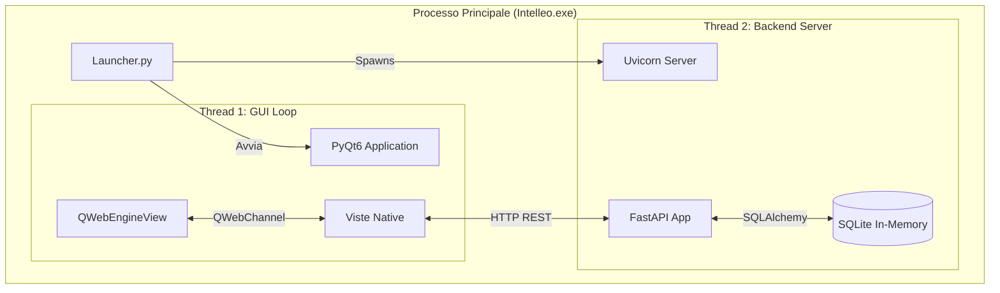

# Architettura di Sistema

Questo documento descrive l'architettura tecnica di **Intelleo**, un'applicazione desktop ibrida che combina un backend Python moderno (FastAPI) con un frontend nativo (PyQt6) e componenti web embedded (React), distribuita come eseguibile monolitico nativo tramite **Nuitka**.

---

## 1. Panoramica Architetturale

Il sistema adotta un pattern **Local-Hosted Client-Server**. Sebbene l'utente percepisca un'unica applicazione desktop, internamente esistono due processi logici distinti che comunicano via HTTP su `localhost`.

### Componenti Core

1.  **Launcher & Controller (PyQt6)**:
    *   Gestisce il ciclo di vita dell'applicazione.
    *   Fornisce l'interfaccia grafica nativa (Finestre, Tray, Dialoghi OS).
    *   Orchestra l'avvio del backend e la gestione delle licenze.
2.  **Backend "Headless" (FastAPI)**:
    *   Esegue la logica di business, l'accesso al database (crittografato in RAM) e l'integrazione AI.
    *   Non ha interfaccia grafica propria.
    *   Espone API RESTful consumate dal Client PyQt.
3.  **Frontend Web (React/Vite)**:
    *   Utilizzato per il Manuale Utente e moduli complessi.
    *   Embedded tramite `QWebEngineView`.
    *   Comunica con il desktop tramite `QWebChannel` (Bridge JS-Python).

---

## 2. Sequenza di Avvio (Boot Sequence)

Il processo di avvio (`launcher.py`) è critico e segue una sequenza rigorosa a 4 fasi per garantire sicurezza e stabilità.

### Fase 0: License Gatekeeper
Prima di caricare qualsiasi componente UI o Backend:
1.  **Verifica Fisica**: Cerca i file `pyarmor.rkey` e `config.dat` in `%LOCALAPPDATA%/Intelleo/Licenza`.
2.  **Verifica Logica**: Tenta di importare un modulo protetto (`app.core.config`).
3.  **Recovery**: Se la licenza è invalida, tenta un aggiornamento "Headless" scaricando i file dal repository GitHub privato. Se fallisce, l'app termina.

### Fase 1: Inizializzazione Ambiente
1.  **Logging**: Configura `logging` per catturare errori su file (`%LOCALAPPDATA%/Intelleo/logs/intelleo.log`) e Sentry.
2.  **Path Resolution**: Usa `app.core.path_resolver` per determinare i percorsi, gestendo le differenze tra modalità Sviluppo e Build Nuitka.
3.  **Port Discovery**: Scansiona le porte 8000-8010 per trovarne una libera.

### Fase 2: Backend Spawn & UI Launch
1.  **Backend Thread**: Avvia `uvicorn.run()` su un `threading.Thread` separato (Daemon).
2.  **Splash Screen**: Mostra la schermata di caricamento.
3.  **Health Check**: Esegue polling su `/api/v1/health` finché il server non risponde (max 60s).

### Fase 3: Database Integrity Check (Post-Launch)
Una volta che l'UI è pronta (Login View):
1.  Il Launcher verifica l'integrità del database cifrato.
2.  **Recovery Dialog**: Se il DB è mancante o corrotto, mostra un dialogo *sopra* la schermata di login permettendo all'utente di:
    *   Creare un nuovo DB.
    *   Ripristinare un backup (`.bak`).
    *   Selezionare un altro file.

---

## 3. Gestione Dati e Sicurezza

### In-Memory Database Architecture
Vedere `app/core/db_security.py`.
*   **Storage**: Il file su disco è cifrato AES-128 (via SQLCipher o layer custom).
*   **Runtime**: All'avvio, il DB viene decifrato e caricato in una connessione `sqlite3` in-memory (`:memory:`).
*   **Persistenza**: Al salvataggio, la memoria viene serializzata, cifrata e sovrascritta su disco.
*   **Concorrenza**: Gestita da `LockManager` basato su file `.lock` con ID processo.

### Comunicazione Inter-Processo (IPC)
*   **Frontend -> Backend**: Chiamate HTTP sincrone tramite `requests` (`desktop_app.api_client.APIClient`). Autenticazione via JWT Bearer Token.
*   **Backend -> Frontend**: Il backend non può chiamare direttamente il frontend. Usa segnali (polling o WebSocket, attualmente polling).
*   **React -> Desktop**: Canale bidirezionale `QWebChannel`.
    *   JS: `channel.objects.bridge.method()`
    *   Python: `@pyqtSlot` esposto su `GuideBridge`.

---

## 4. Build System (Nuitka)

L'applicazione è compilata in codice macchina nativo usando **Nuitka**.

*   **Entry Point**: `launcher.py`.
*   **Output**: Cartella `dist/nuitka/Intelleo.dist`.
*   **Gestione Dipendenze**:
    *   DLL di sistema spostate in `dll/` e aggiunte al PATH a runtime.
    *   Risorse statiche (`assets/`, `icons/`) incluse nel pacchetto.
*   **Protezione**:
    *   Il codice Python non è estraibile (è compilato in C).
    *   Costanti sensibili sono offuscate.
